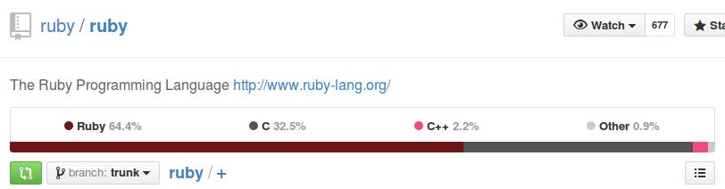

title: Agenda

* Introdução
* Python
* Ruby
* JavaScript
* Outras

---

title: Introdução
class: segue dark nobackground

---

title: Introdução

<!--
Functional programming requires that functions are first-class, which means that they are treated like any other values and can be passed as arguments to other functions or be returned as a result of a function. Being first-class also means that it is possible to define and manipulate functions from within other functions.
-->

**Programação Funcional** (PF) requer que funções sejam tratadas como
**valores de primeira importância**, o que significa que elas são tratadas
com qualquer outro valor e podem ser passadas como argumento para outras funções
ou serem retornadas como resultado de uma função.

Serem tratadas como valores de primeira importância
resulta também na possibilidade de definir e manipular funções dentro de outras
funções.

---

title: Python
class: segue nobackground fill
image: img/py-bg.jpg

---

title: Linguagens que suportam PF

## Python

* Funções `lambda`
* Funções de primeira importância
* Funções podem retornam funções

---

title: Python
subtitle: Funções lambda

<pre class="prettyprint" data-lang="python">
multi = lambda x, y: x * y

print multi(2, 3)
&#35; => 6
</pre>

<pre class="prettyprint" data-lang="python">
print map(lambda x: x ** 2, [1, 2, 3, 4, 5])
&#35; => [1, 4, 9, 16, 25]
</pre>

---

title: Python
subtitle: Funções de primeira importância

<pre class="prettyprint" data-lang="python">
list = [1, 2, 3, 4, 5]
filter(lambda x: x % 2 == 0, list)
&#35; => [2, 4]
</pre>

<pre class="prettyprint" data-lang="python">
def square(x):
    return x * x

list = [1, 2, 3, 4, 5]
map(square, list)
&#35; => [1, 4, 9, 16, 25]
</pre>

---

title: Python
subtitle: Funções de primeira importância

<pre class="prettyprint" data-lang="python">
sum = reduce(lambda a, x: a + x, [0, 1, 2, 3, 4])
print sum

&#35; => 10
</pre>

---

title: Python
subtitle: Funções de primeira importância

Exemplo real de uso em um programa que resolve o quebra-cabeça de 8 peças.

<pre class="prettyprint" data-lang="python">
def _generate_moves(self):
    free = self._get_legal_moves()
    zero = self.find(0)
 
    def swap_and_clone(a, b):
        p = self._clone()
        p.swap(a,b)
        p._depth = self._depth + 1
        p._parent = self
        return p

    return map(lambda pair: swap_and_clone(zero, pair), free)
</pre>

<https://gist.github.com/flatline/838202>

---

title: Ruby
class: segue nobackground fill
image: img/rb-bg.jpg

---

title: Linguagens que suportam PF

## Ruby

* Funções de primeira importância, chamadas de _blocks_
* Memoization ou guardar resultados de funções com alto nível de processamento

---

title: Ruby
subtitle: Funções de primeira importância

<pre class="prettyprint" data-lang="ruby">
write_block = proc { |file| file.write("Hello World") }
open("file.txt", &write_block)
</pre>

ou apenas

<pre class="prettyprint" data-lang="ruby">
open("file.txt") { |file| file.write("Hello World") }
</pre>

---

title: Ruby
subtitle: Funções de primeira importância

Ruby se utiliza muito desse artifício, veja:

<pre class="prettyprint" data-lang="ruby">
a = %w{ a b c d e f }
a.keep_if { |v| v =~ /[aeiou]/ }
&#35; => ["a", "e"]
</pre>

---

title: Ruby
subtitle: Memoization

<pre class="prettyprint" data-lang="ruby">
class Location
  def geocoding(lat, long)
    &#35; ... complicated stuff goes here ..
  end
  
  memoize :geocoding
end

location = Location.new
location.geocoding(45.123, 123.45) &#35; => irá demorar um pouco
location.geocoding(45.123, 123.45) &#35; => retorna imediatamente
location.geocoding(12.876, 76.914) &#35; => não foi memorizado ainda, irá demorar
location.geocoding(12.876, 76.914) &#35; => retorna imediatamente
location.geocoding(45.123, 123.45) &#35; => retorna imediatamente, continua memorizado
</pre>

---

title: Ruby
subtitle: Memoization

Como functiona? <https://github.com/tokland/simple_memoize>

<pre class="prettyprint" data-lang="ruby">
&#35; ... trecho
def memoize(*method_names)
  method_names.each do |method_name|
    method_name = method_name.to_s
    stripped_method_name = method_name.sub(/([!?])$/, '')
    punctuation = $1
    wordy_punctuation = (punctuation == '!' ? '_bang' : '_huh') if punctuation
    ivar_name = "@#{stripped_method_name}#{wordy_punctuation}"
    memoized_method_name = "#{stripped_method_name}_with_memo#{punctuation}"
    regular_method_name = "#{stripped_method_name}_without_memo#{punctuation}"
    &#35; ... continua ...
</pre>

---

title: Ruby
subtitle: Memoization

<pre class="prettyprint" data-lang="ruby">
return if self.method_defined?(memoized_method_name)
self.class_eval "
  def #{memoized_method_name}(*args)
    if defined?(#{ivar_name}) && #{ivar_name}.include?(args)
      #{ivar_name}[args]
    else
      #{ivar_name} ||= Hash.new
      #{ivar_name}[args] = #{regular_method_name}(*args)
    end
  end
  alias_method :#{regular_method_name}, :#{method_name}
  alias_method :#{method_name}, :#{memoized_method_name}
  protected :#{method_name} if protected_instance_methods.include?('#{regular_method_name}')
  private :#{method_name} if private_instance_methods.include?('#{regular_method_name}')
  "
end
</pre>

---

title: Ruby
subtitle: Curiosidades

<pre class="prettyprint" data-lang="ruby">
irb(main):014:0> 1.methods
=> ["%", "odd?", "inspect", "prec_i", "<<", "tap", "div", "&", "clone", ">>",
"public_methods", "__send__", "object_id", "instance_variable_defined?",
"equal?", "freeze", "to_sym", "*", "ord", "+", "extend", "next", "send",
"round", "methods", "prec_f", "-", "even?", "singleton_method_added", "divmod",
"hash", "/", "integer?", "downto", "dup", "to_enum", "instance_variables", "|",
"eql?", "size", "instance_eval", "truncate", "~", "id", "to_i", "singleton_methods",
"modulo", "taint", "zero?", "times", "instance_variable_get", "frozen?", "enum_for",
"display", "instance_of?", "^", "method", "to_a", "+@", "-@", "quo", "instance_exec",
"type", "**", "upto", "to_f", "<", "step", "protected_methods", "<=>", "between?",
"==", "remainder", ">", "===", "to_int", "nonzero?", "pred", "instance_variable_set",
"coerce", "respond_to?", "kind_of?", "floor", "succ", ">=", "prec", "to_s", "<=",
"fdiv", "class", "private_methods", "=~", "tainted?", "__id__", "abs", "untaint",
"nil?", "chr", "id2name", "is_a?", "ceil", "[]"]
</pre>

---

title: Ruby
subtitle: Curiosidades

<pre class="prettyprint" data-lang="ruby">
irb(main):022:0> 1 + 2
=> 3
irb(main):023:0> 1.+ 2
=> 3
irb(main):024:0> 1.+(2)
=> 3
irb(main):025:0> 10 / 2
=> 5
irb(main):026:0> 10./ 2
=> 5
irb(main):027:0> 10./(2)
=> 5
</pre>

---

title: Ruby
subtitle: Curiosidades

<https://github.com/ruby/ruby/>

64.4% de Ruby é Ruby!

---

title: JavaScript
class: segue nobackground fill
image: img/js-bg.jpg

---

title: Linguagens que suportam PF

## JavaScript

Mais próxima de uma linguagem funcional. Suporta:

* Funções de primeira importância
* Funções podem retornam funções
* Blocos léxicos + Escopo

---

title: JavaScript
subtitle: Exemplo - Funções de primeira importância

<pre class="prettyprint" data-lang="javascript">
var hosts = [];
/* ... */
function verify_hosts(h_initial, h_final, <b>callback</b>) {
	for (var i = h_initial; i < h_final; i++) {
    	hosts[i].verify();
    }
    <b>callback();</b>
}
</pre>

---

title: JavaScript
subtitle: Exemplo - Funções podem retornar funções

<pre class="prettyprint" data-lang="javascript">
var curry = function (fn) {
	return function (value1) {
    	return function (value2) {
        	return fn(value1, value2);
        };
    };
};

var mult = function(a, b) { return a * b; };

var twice = curry(mult)(2);
twice(4); // => 8
twice(6); // => 12
</pre>

---

title: JavaScript
subtitle: Exemplo - Blocos léxicos + Escopo

<pre class="prettyprint" data-lang="javascript">
// global scope
var scope = "global";

var foo = function(){
    // inner scope 1
    var scope = "inner";
    var myscope = function(){
        // inner scope 2
        return scope;
    };
    return myscope;
};

console.log(foo()()); // => "inner"
console.log(scope); // => "global"
</pre>

---

title: JavaScript
subtitle: Exemplo - Funções de primeira importância

Underscore.JS

Underscore is a JavaScript library that provides a whole mess of
useful functional programming helpers without extending any built-in objects.

Entre outras coisas: **map, filter, invoke**

<http://underscorejs.org/>

---

title: JavaScript
subtitle: Underscore.JS

<pre class="prettyprint" data-lang="javascript">
_.map([1, 2, 3], function(num){ return num * 3; });
// => [3, 6, 9]
_.map({one: 1, two: 2, three: 3}, function(num, key){ return num * 3; });
// => [3, 6, 9]

var evens = _.filter([1, 2, 3, 4, 5, 6], function(num){ return num % 2 == 0; });
// => [2, 4, 6]

var stooges = [{name: 'moe', age: 40}, {name: 'larry', age: 50}, {name: 'curly', age: 60}];
_.max(stooges, function(stooge){ return stooge.age; });
// => {name: 'curly', age: 60};
</pre>

---

title: JavaScript
subtitle: "It's a trap!"
class: segue nobackground fill
image: img/js-its-a-trap.jpg

---

title: JavaScript
subtitle: It's a trap!

<pre class="prettyprint" data-lang="javascript">
function User() {
    this.name = 'Átila';
    this.uid = 0;
}

User.prototype.get = function(fn) {
    return fn();
};

var user = new User();
var name = user.get(function() {
    return this.name;
});
console.log('name: ' + name);
</pre>

---

title: JavaScript
subtitle: It's a trap!

<pre>
~/fp-like/src/self-worng.js:15
    return this.name;
               ^
TypeError: Cannot read property 'name' of undefined
</pre>

---

title: JavaScript
subtitle: It's a trap!

<pre class="prettyprint" data-lang="javascript">
function User() {
    this.name = 'Átila';
    this.uid = 0;
}

User.prototype.get = function(fn) {
    return fn(<b>this</b>);
};

var user = new User();
var name = user.get(function(<b>self</b>) {
    return <b>self.name</b>;
});
console.log('name: ' + name);
</pre>

---

title: JavaScript
subtitle: Extensível!

<pre class="prettyprint" data-lang="javascript">
var user = new User();
var uid_name_s = user.get(function(self) {
    return 'uid: ' + self.uid + ', name: ' + self.name;
});
console.log(uid_name_s);
</pre>

Saída:

<pre>
uid: 0, name: Átila
</pre>

---

title: Links

FP

* <http://www.haskell.org/haskellwiki/Functional_programming>

JavaScript

* <http://underscorejs.org/>
* <http://underscorejs.org/underscore.js>
* <http://xkr.us/articles/javascript/unary-add/>
* <http://eloquentjavascript.net/1st_edition/chapter6.html>
* <http://eliperelman.com/fn.js/>

---

title: Links

JavaScript

* <http://jhusain.github.io/learnrx/>
* <http://tech.pro/tutorial/2009/functional-javascript-part-2-what-makes-a-language-functional>

Ruby

* <http://pt.slideshare.net/tokland/functional-programming-with-ruby-9975242>
* <http://www.ruby-doc.org/core-2.1.2/Array.html>
* <http://www.reactive.io/tips/2008/12/21/understanding-ruby-blocks-procs-and-lambdas/>
* <https://github.com/ruby/ruby>

---

title: Links

Python

* <http://www.ibm.com/developerworks/library/l-prog/>
* <http://anandology.com/python-practice-book/functional-programming.html>
* <http://www.infoq.com/articles/fn.py-functional-programming-python>
* <http://maryrosecook.com/blog/post/a-practical-introduction-to-functional-programming>

